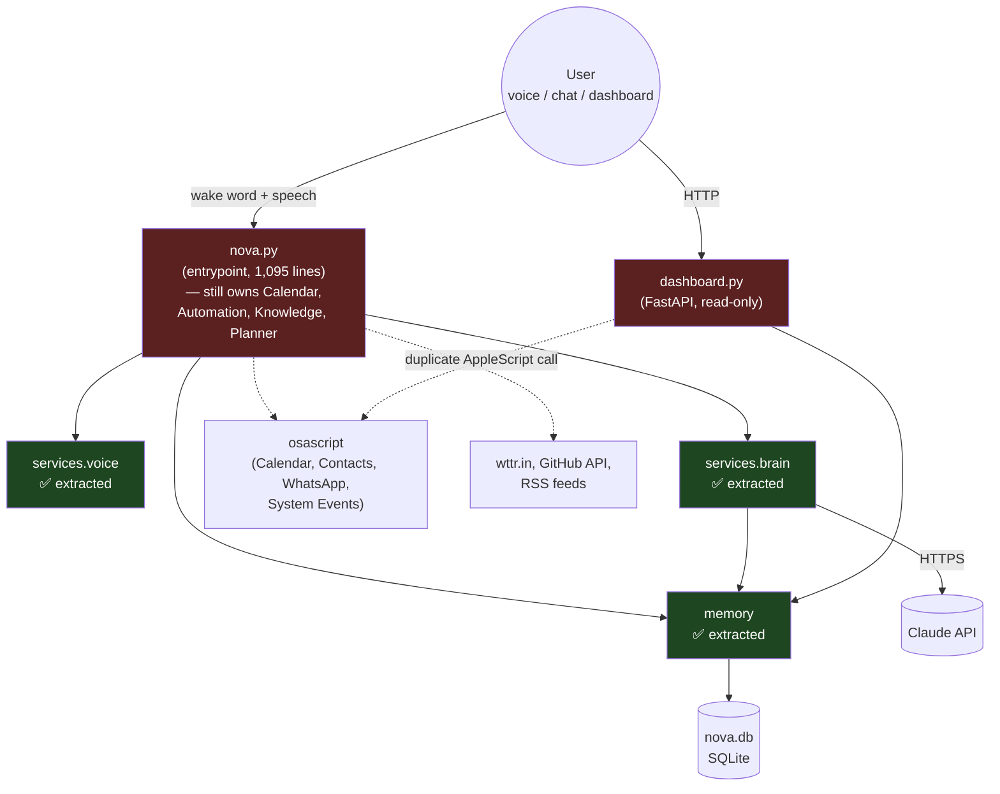
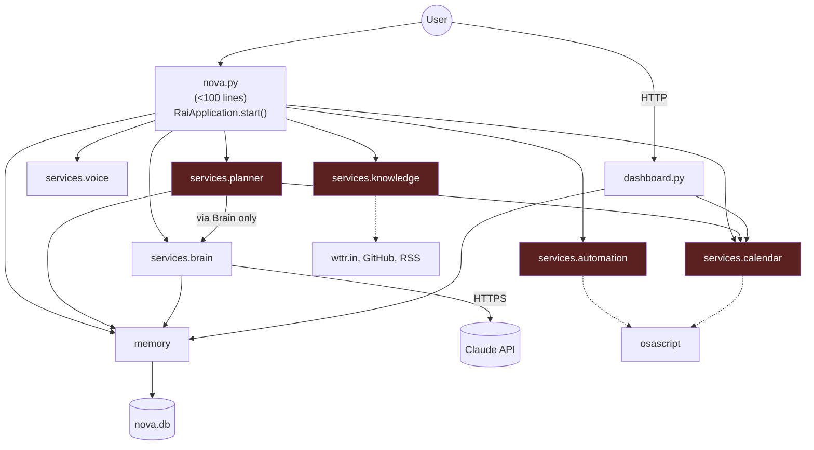

# Phase 1 — Architecture Foundation

> Objective per roadmap: convert RAI from a large Python script into a modular operating system. No new capabilities — architecture only.

**Status: 3 / 8 milestones complete (37.5%)**

| Milestone | Status |
|---|---|
| 1. Memory Service | ✅ Done |
| 2. Voice Service | ✅ Done |
| 3. Brain Service | ✅ Done |
| 4. Planner Service | ❌ Not started |
| 5. Calendar Service | ❌ Not started |
| 6. Automation Service | ❌ Not started |
| 7. Knowledge Service | ❌ Not started |
| 8. Bootstrap | ❌ Not started |

---

## 1. What changed

Relative to the single prior commit (`b0d26e4`, "Rai phases 0–5 complete" — old feature-numbered roadmap), the working tree now contains a from-scratch service-layer extraction plus a new dashboard:

- **Memory extracted**: all `sqlite3` access was pulled out of `nova.py` into a new `memory/` package (schema, connection helper, and one module per domain: tasks, money, progress, products, reminders, habits, profile).
- **Voice extracted**: wake word, microphone, Whisper transcription, and TTS were pulled into `services/voice/`.
- **Brain extracted**: Claude API calls, system-prompt construction, tool schema/dispatch, conversation history, and the weekly reflection job were pulled into `services/brain/`.
- **`nova.py` rewired** to import `memory`, `services.brain`, and `services.voice` instead of doing any of that work itself — but it **grew**, not shrank (net +850 lines in this diff), because Calendar, Automation (WhatsApp/open-app), Knowledge (weather/GitHub/RSS), and Planner (briefing/wrap-up/pomodoro) logic all still live there, plus all 22 tool handlers and the legacy regex command parser.
- **New `dashboard.py`** (FastAPI, untracked, 738 lines): a read-only web dashboard that reads through `memory/`'s public API, but **re-implements** calendar fetching independently via its own AppleScript call rather than reusing `nova.py`'s calendar code (there is nowhere shared to reuse it from yet — see [Known Issues](#8-known-issues)).
- `requirements.txt` gained `fastapi` and `uvicorn[standard]` for the dashboard.
- Three roadmap documents accumulated in the repo root (`RAI-ROADMAP-3.md`, `Rai-ROADMAP-4.md`, plus the pre-existing `RAI_ROADMAP.md` / `RAI-ROADMAP-2.md`) — v4 is the authoritative one going forward.

---

## 2. Folder structure

```
rai/
├── nova.py                      # entrypoint + everything not yet extracted (1,095 lines)
├── dashboard.py                # FastAPI read-only web dashboard (738 lines, untracked)
├── requirements.txt
├── nova.db                     # SQLite, owned exclusively by memory/
├── services/
│   ├── __init__.py             # EMPTY — no re-exports (see Known Issues)
│   ├── brain/
│   │   ├── __init__.py         # public API surface
│   │   ├── client.py           # ask() / route() — Claude HTTP calls
│   │   ├── config.py           # API key, model, endpoint, check_api_config()
│   │   ├── history.py          # in-memory conversation turn buffer
│   │   ├── prompts.py          # system prompt assembly (reads memory/)
│   │   ├── reflection.py       # weekly profile-reflection job (reads/writes memory/)
│   │   └── tools.py            # RAI_TOOLS schema (22 tools) + execute() dispatcher
│   └── voice/
│       ├── __init__.py         # public API surface
│       ├── audio.py            # mic capture, RMS gating
│       ├── config.py           # wake word, Whisper, TTS settings
│       ├── session.py          # wake-word polling, follow-up loop, record_command()
│       ├── transcription.py    # Whisper model load + transcribe()
│       ├── tts.py               # speak() via macOS `say` or Piper
│       └── wake_word.py        # wake-word match + audio cue
├── memory/
│   ├── __init__.py             # public API surface (34 exported names)
│   ├── _connection.py          # private: sqlite3 connect(), now(), DB_PATH
│   ├── schema.py               # init_db() — CREATE TABLE IF NOT EXISTS x7
│   ├── tasks.py / money.py / progress.py / products.py /
│   │   reminders.py / habits.py / profile.py   # one repository module per domain
└── review_report/              # this report (new)
```

**Not yet present** (required by Milestones 4–8): `services/planner/`, `services/calendar/`, `services/automation/`, `services/knowledge/`, and any `RaiApplication` bootstrap module.

---

## 3. Files added

*(untracked in git; new relative to base commit `b0d26e4`)*

| File | Lines | Purpose |
|---|---:|---|
| `dashboard.py` | 738 | FastAPI read-only dashboard (summary, reminders, tasks, money, calendar) |
| `memory/__init__.py` | 78 | Memory service public API |
| `memory/_connection.py` | 24 | Private sqlite3 connection helper |
| `memory/schema.py` | 62 | Table creation |
| `memory/tasks.py` | 76 | Task CRUD |
| `memory/money.py` | 52 | Earnings/spend CRUD + aggregates |
| `memory/progress.py` | 43 | Progress-note CRUD |
| `memory/products.py` | 37 | Product CRUD |
| `memory/reminders.py` | 50 | Reminder CRUD |
| `memory/habits.py` | 30 | Habit-log CRUD |
| `memory/profile.py` | 36 | Long-term profile-observation storage |
| `services/__init__.py` | 0 | Empty — package marker only |
| `services/brain/__init__.py` | 34 | Brain service public API |
| `services/brain/client.py` | 83 | `ask()` / `route()` |
| `services/brain/config.py` | 20 | Claude API config |
| `services/brain/history.py` | 25 | Conversation history buffer |
| `services/brain/prompts.py` | 54 | System prompt builder |
| `services/brain/reflection.py` | 97 | Weekly reflection job |
| `services/brain/tools.py` | 268 | Tool schema + dispatcher (largest service file) |
| `services/voice/__init__.py` | 21 | Voice service public API |
| `services/voice/audio.py` | 30 | Mic capture |
| `services/voice/config.py` | 25 | Voice config |
| `services/voice/session.py` | 76 | Wake/record/follow-up orchestration |
| `services/voice/transcription.py` | 19 | Whisper load/transcribe |
| `services/voice/tts.py` | 26 | Text-to-speech |
| `services/voice/wake_word.py` | 12 | Wake-word matching |
| `RAI-ROADMAP-3.md`, `Rai-ROADMAP-4.md` | — | Roadmap documents |

**Total new service/memory code: 1,278 lines across 24 files** (services + memory, excluding `__pycache__`).

---

## 4. Files modified

| File | Diff | Nature of change |
|---|---|---|
| `nova.py` | +850 / −379 (net +471, now 1,095 lines) | Rewired to use `memory`/`services.brain`/`services.voice`; Calendar, Automation, Knowledge, Planner logic, and all 22 tool handlers remain inline |
| `requirements.txt` | +2 lines | Added `fastapi`, `uvicorn[standard]` for the dashboard |

---

## 5. Public APIs

### `memory` (Milestone 1 — ✅ done)

```python
init_db() -> None

# tasks
add_task(text, due=None) -> None
complete_task(text) -> bool
get_open_tasks() -> list[dict]
count_open_tasks() -> int
get_recent_tasks(limit) -> list[dict]
get_recent_open_tasks(limit) -> list[dict]
get_done_tasks_since(date) -> list[dict]
get_done_task_texts_for_date(date) -> list[str]

# money
add_money(type, amount, note="") -> None
get_recent_money(limit) -> list[dict]
get_money_since(date) -> list[dict]
get_money_totals_between(start, end) -> tuple[float, float]
get_money_totals_for_date(date) -> tuple[float, float]

# progress
add_progress(note, area="") -> None
get_recent_progress(limit) -> list[dict]
get_progress_since(date) -> list[dict]
get_progress_notes_for_date(date, exclude_area=None, limit=None) -> list[str]

# products
add_product(name, store="", price=None) -> None
ship_product(name) -> bool
log_sale(name) -> bool
get_products() -> list[dict]

# reminders
add_reminder(text, remind_date) -> None
get_due_reminders(date) -> list[dict]
get_upcoming_reminders(limit) -> list[dict]
count_reminders() -> int
get_recent_reminders(limit) -> list[dict]

# habits
log_habit(name) -> None
get_habits_today() -> list[dict]
get_recent_habits(limit) -> list[dict]

# profile
get_profile_observations() -> list[dict]
get_last_profile_update() -> str | None
replace_profile_observations(observations) -> None
```
`memory/_connection.py` (`connect()`, `now()`, `DB_PATH`) is explicitly **private** — not exported from `__init__.py`, and no other module imports it directly. Milestone-1 verification ("no module accesses SQLite directly") holds: only `memory/*.py` files import `sqlite3`/`_connection`.

### `services.voice` (Milestone 2 — ✅ done)

```python
load_model() -> WhisperModel
speak(text: str) -> None
new_listener_state() -> ...
poll_wake_word(model, prev_hop) -> tuple[bool, state]
record_command(model) -> str
wait_for_followup(model) -> bool
```
Fully self-contained: `services/voice/*.py` imports nothing from `services.brain` or `memory`. Milestone-2 verification ("no audio logic in nova.py", "voice can be disabled without breaking the system") holds structurally — `nova.py` only calls the 6 functions above.

### `services.brain` (Milestone 3 — ✅ done)

```python
ask(prompt: str, history: list) -> str
route(transcript: str, handlers: dict[str, Callable], history: list) -> str
check_api_config() -> None
build_system_prompt(...) -> str
run_reflection_job() -> str
should_run_reflection() -> bool
RAI_TOOLS: list[dict]          # 22 tool schemas fed to Claude
execute_tool(name, args, handlers) -> str
history.get() / history.add_turn() / history.clear()
ANTHROPIC_API_URL, RAI_CLAUDE_API_KEY, RAI_MODEL, REPLY_LANGUAGE
```
`services/brain/prompts.py` and `reflection.py` import from `memory` (by design — Brain is allowed to read Memory per the roadmap's Milestone-3 expectation "Uses Memory APIs"). Brain does **not** import `services.voice`, so Claude can be swapped without touching Voice — Milestone-3 verification holds.

### Milestones 4–7 (Planner, Calendar, Automation, Knowledge) — no service module exists yet, so there is no service-level public API. The equivalent logic is currently exposed only as free functions inside `nova.py`:

```python
# would become services/calendar/*
parse_date(text) -> datetime | None
parse_time(text) -> tuple[int, int] | None
add_calendar_event(title, date_obj, time_tuple=None) -> bool
get_events(day=None) -> list[dict]

# would become services/automation/*
send_whatsapp_message(contact_name, message) -> str
run_command(cmd: list[str]) -> None
match_command(transcript) -> tuple[str | None, list[str] | None]
COMMANDS: dict[str, list[str]]

# would become services/knowledge/*
get_weather(location="") -> str
get_github_notifications(limit=5) -> str
get_rss_updates(feed_urls=None, limit=3) -> str

# would become services/planner/*
build_morning_briefing() -> str
build_evening_wrapup() -> str
read_my_day() -> str
get_spending_summary(period="this week") -> str
start_pomodoro(minutes=25) -> str
```

---

## 6. Dependency graph

Current, verified from actual imports (not aspirational):

```mermaid
graph TD
    subgraph "nova.py (entrypoint — 1,095 lines)"
        RAI[nova.py]
    end

    subgraph "services/"
        BRAIN[services.brain]
        VOICE[services.voice]
    end

    MEMORY[memory]
    DASH[dashboard.py]

    RAI -->|"ask, route, history,\ncheck_api_config, run_reflection_job"| BRAIN
    RAI -->|"load_model, speak,\npoll_wake_word, record_command"| VOICE
    RAI -->|"init_db, add_task, get_events...\n(via inline calendar/automation/knowledge)"| MEMORY
    RAI -.->|"inline AppleScript\n(no service exists)"| CAL[macOS Calendar]
    RAI -.->|"inline AppleScript\n(no service exists)"| WA[WhatsApp / Contacts]
    RAI -.->|"inline HTTP\n(no service exists)"| EXT[wttr.in / GitHub / RSS]

    BRAIN -->|"prompts.py, reflection.py read profile/tasks/etc"| MEMORY
    DASH -->|"read-only queries"| MEMORY
    DASH -.->|"duplicate inline AppleScript\n(does NOT reuse nova.py's get_events)"| CAL

    VOICE -.->|no dependency| BRAIN
    VOICE -.->|no dependency| MEMORY

    style RAI fill:#5b2020
    style DASH fill:#5b2020
    style CAL fill:#333
    style WA fill:#333
    style EXT fill:#333
```



**Observations:**
- `memory` is a true leaf — zero outgoing dependencies on other RAI code. Good.
- `services.voice` is a true leaf — zero outgoing dependencies on other RAI code. Good.
- `services.brain` depends only on `memory`, per the roadmap's own allowance. No dependency on `voice`. **No circular dependencies exist today.**
- `nova.py` is the only module touching AppleScript / WhatsApp / weather / GitHub / RSS — but it isn't a service, it's the entrypoint, so nothing else can reuse that logic without importing `nova.py` itself (which `dashboard.py` correctly avoids — and ends up duplicating logic instead, which is worse).
- `dashboard.py` → Calendar is a **duplicate edge**, not a reuse edge. This is the clearest architectural smell in the current tree.

Target end-state (Milestones 4–8 complete) would replace the dotted edges with real `services/calendar`, `services/automation`, `services/knowledge`, `services/planner` nodes that both `nova.py` and `dashboard.py` depend on — eliminating the duplication.

---

## 7. Remaining work

To close Phase 1 (5 milestones):

1. **Milestone 4 — Planner Service**: extract `build_morning_briefing`, `build_evening_wrapup`, `read_my_day`, `get_spending_summary`, `start_pomodoro` into `services/planner/`. Per roadmap, Planner must consume Calendar/Memory/Goals/Tasks and call Claude only through Brain — currently `read_my_day`/briefing call `memory` and `get_events` directly, which is fine, but `_handle_journal`'s direct `brain.ask()` call blurs a line worth revisiting when Planner exists.
2. **Milestone 5 — Calendar Service**: extract `parse_date`, `parse_time`, `add_calendar_event`, `get_events`, and the `_as_date_block` AppleScript helper into `services/calendar/`. This also fixes the `dashboard.py` duplication (issue in §8).
3. **Milestone 6 — Automation Service**: extract `send_whatsapp_message`, `COMMANDS`, `match_command`, `run_command`, `_handle_open_app` into `services/automation/`, ideally as a plugin-per-integration structure per the roadmap's "plugin-based architecture" expectation (WhatsApp plugin, app-launcher plugin, etc., each addable without touching the others).
4. **Milestone 7 — Knowledge Service**: extract `get_weather`, `get_github_notifications`, `get_rss_updates` into `services/knowledge/`. Roadmap requires "Knowledge contains no Claude logic" — currently true, easy to preserve.
5. **Milestone 8 — Bootstrap**: once 4–7 are done, `nova.py` should collapse toward the roadmap's `RaiApplication` sketch (`from services import *`, `app.start()`). This also requires populating `services/__init__.py`, which is currently empty.
6. **Cross-cutting, needed regardless of milestone**: add tests (`Definition of Done` requires "Unit-testable" + Milestone 1 explicitly requires "Tests" — none exist yet for `memory/`, `services/brain/`, or `services/voice/` even though those milestones are marked done); add per-service `README`/docstring-level documentation (Milestone 1 requires "Documentation" — currently only inline docstrings, no dedicated docs).
7. Only after all 8 milestones close can Phase 2 (Semantic Memory / LanceDB) begin, per the roadmap's explicit gate.

---

## 8. Known issues

| Issue | Where | Severity | Roadmap rule violated |
|---|---|---|---|
| Duplicated calendar-fetch logic | `dashboard.py:116-160` reimplements `nova.py`'s `get_events()` via a second, independent AppleScript call | High | "No duplicated logic" |
| `nova.py` still owns 4 unextracted concerns (Calendar, Automation, Knowledge, Planner) | `nova.py` | High | "Never grow `nova.py`", "One service per milestone" |
| No tests anywhere in the repo | whole tree | High | Definition of Done: "Unit-testable"; Milestone 1: "Tests" |
| `services/__init__.py` is empty | `services/__init__.py` | Medium | Blocks the target `from services import *` Bootstrap shape |
| No per-service documentation beyond docstrings | `services/*`, `memory/` | Medium | Milestone 1: "Documentation"; Definition of Done: "Documentation updated" |
| `_handle_journal` / journal action call `brain.ask()` directly from `nova.py` instead of going through a Planner or a single routing path | `nova.py:596-606`, `941-951` | Low | Slight blur of "Brain never directly manipulates storage" boundary — not a violation today (it manipulates nothing directly), but a preview of the same handler-in-entrypoint pattern that needs to move once Planner exists |
| Four roadmap files coexist in repo root (`RAI_ROADMAP.md`, `RAI-ROADMAP-2.md`, `RAI-ROADMAP-3.md`, `Rai-ROADMAP-4.md`) with overlapping/contradictory phase numbering | repo root | Low (documentation hygiene, not code) | N/A — but actively caused the `phase-7-calendar` branch-name ambiguity this report had to disambiguate |
| `nova.db` and `.env` are gitignored (correct) but `nova.db` in the working tree (36 KB) means schema changes aren't reproducible from a clean checkout without running `init_db()` | root | Low | N/A — just a note for onboarding |

---

## 9. Architecture diagram

### Current state (Phase 1, mid-flight)



### Target state (Phase 1 complete — Milestone 8 shape)



---

## 10. Current completion percentage

- **Phase 1 milestones complete: 3 / 8 = 37.5%**
- **Lines extracted into services vs. remaining in `nova.py`:** 1,278 lines now live in `services/` + `memory/`; `nova.py` is still 1,095 lines, of which an estimated ~450–500 lines are Calendar/Automation/Knowledge/Planner logic that should eventually move out (rough estimate from function boundaries, not a formal count).
- **Bootstrap target:** `nova.py` needs to shrink from 1,095 → <100 lines; currently at **~11x** the target size.
- **Definition-of-Done checklist, applied to the 3 "done" milestones:**

  | Requirement | Memory | Voice | Brain |
  |---|---|---|---|
  | Architecture reviewed | Not on record | Not on record | Not on record |
  | Single Responsibility | ✅ | ✅ | ✅ |
  | Public API documented | Partial (docstrings only) | Partial (docstrings only) | Partial (docstrings only) |
  | No circular dependencies | ✅ | ✅ | ✅ |
  | Unit-testable | Structurally yes, **no tests written** | Structurally yes, **no tests written** | Structurally yes, **no tests written** |
  | Logging added | ❌ (uses bare `print`) | ❌ (uses bare `print`) | ❌ (uses bare `print`) |
  | Configuration supported | ✅ (`.env` via `dotenv`) | ✅ | ✅ |
  | Documentation updated | Partial | Partial | Partial |
  | No regressions | Not verifiable without tests | Not verifiable without tests | Not verifiable without tests |

  None of the 3 "done" milestones fully clears the Definition of Done — they are functionally complete but process-incomplete (no tests, no formal architecture review sign-off, `print`-based logging instead of a logging framework).
