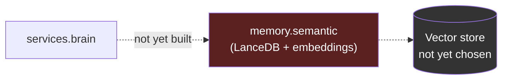

# Phase 2 — Semantic Memory

> Goal per roadmap: upgrade memory without changing architecture.
> Deliverables: LanceDB, Embeddings, Semantic Search, Long-term Memory, Importance Scoring, Retrieval Pipeline.
> Verification: RAI answers questions about old conversations using semantic retrieval.

**Status: Not started (0%)**

**Gate:** Roadmap v4 states "Only after ALL [Phase 1 milestones] are complete may Phase 2 begin." Phase 1 is at 3/8 (see [phase-1-architecture-foundation.md](phase-1-architecture-foundation.md)), so Phase 2 is not yet unblocked.

---

## 1. What changed
Nothing. No commits, files, or code paths in the working tree reference LanceDB, embeddings, or semantic retrieval.

## 2. Folder structure
No `services/memory_semantic/` (or equivalent) directory exists. Current `memory/` (see Phase 1) is purely relational (SQLite via `sqlite3`), with no vector store.

## 3. Files added
None.

## 4. Files modified
None.

## 5. Public APIs
None defined. Anticipated shape based on the roadmap deliverables and the existing `memory/` package's conventions (one repository module per domain, private `_connection`-style internals, `__init__.py` re-export surface):

```python
# hypothetical — not implemented
embed_and_store(text: str, source: str, importance: float | None = None) -> None
semantic_search(query: str, k: int = 5) -> list[dict]
score_importance(text: str) -> float
```

## 6. Dependency graph
Not applicable — no code exists. Per the roadmap goal ("upgrade memory without changing architecture"), the expected graph would extend `memory/` internally (e.g. `memory/semantic.py` sitting alongside `memory/tasks.py`) rather than introduce a new top-level service, keeping `services.brain`'s existing `memory` dependency edge unchanged.

## 7. Remaining work
Everything: choose and vendor LanceDB, define an embedding pipeline (model choice, chunking strategy), design importance scoring, wire a retrieval pipeline into `services.brain`'s prompt construction (`services/brain/prompts.py`), and add conversation-history persistence beyond the current in-memory `services/brain/history.py` buffer (which is cleared every wake-word session and has no long-term storage today).

## 8. Known issues
- `services/brain/history.py` currently holds conversation turns only in-process, cleared at the end of each wake-word session (`nova.py`, `brain.history.clear()`). There is no durable conversation log for Phase 2 to build semantic retrieval on top of yet — this is a prerequisite gap, not just missing Phase-2 code.

## 9. Architecture diagram


## 10. Current completion percentage
**0%.** Blocked on Phase 1 completion per roadmap gate.
