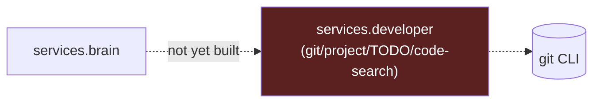

# Phase 4 — Developer Service

> Deliverables per roadmap: Git awareness, Project awareness, Branch tracking, TODO analysis, Code search, Architecture review.
> Verification: "Continue yesterday's work" restores development context.

**Status: Not started (0%)**

**Gate:** Blocked behind Phases 1–3 per roadmap ordering.

---

## 1. What changed
Nothing. No git-awareness, TODO-scanning, or code-search functionality exists anywhere in the repo. RAI itself is developed inside a git repo (`rai`, currently on `phase-7-calendar`), but RAI has no code that introspects *any* git repo, including its own.

## 2. Folder structure
No `services/developer/` directory exists.

## 3. Files added
None.

## 4. Files modified
None.

## 5. Public APIs
None defined. Anticipated shape, not implemented:

```python
# hypothetical — not implemented
get_current_branch(repo_path: str) -> str
summarize_recent_commits(repo_path: str, since: str) -> str
find_todos(repo_path: str) -> list[dict]
search_code(repo_path: str, query: str) -> list[dict]
```

## 6. Dependency graph
Not applicable — no code exists. Would likely shell out to `git` (similar pattern to how `services/voice/tts.py` shells out to macOS `say`, or how Calendar logic shells out to `osascript`) and depend on `services.brain` for summarization, plus `memory` for storing "what I was doing yesterday" context.

## 7. Remaining work
Everything: git log/diff/branch introspection, project-awareness (detecting active repos/directories), TODO/FIXME scanning, code search (grep-based or embedding-based, possibly reusing Phase 2/3 infrastructure), and an "architecture review" capability that seems to overlap conceptually with the roadmap's own "Architecture Review Prompt" section — worth deciding whether that becomes a literal RAI capability or stays a human-run prompt template.

## 8. Known issues
None to report — no code exists to have issues.

## 9. Architecture diagram


## 10. Current completion percentage
**0%.** Blocked on Phases 1–3.
