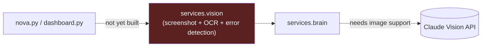

# Phase 5 — Vision

> Deliverables per roadmap: Screenshot pipeline, OCR, Claude Vision, UI understanding, Error detection.
> Verification: RAI recognizes build errors from screenshots and explains them.

**Status: Not started (0%)**

**Gate:** Blocked behind Phases 1–4 per roadmap ordering.

**Naming note:** don't confuse this with the *old* roadmap's "phases 0–5" referenced in commit `b0d26e4`'s message — that refers to `RAI_ROADMAP.md`'s feature-numbered phases (voice, memory, WhatsApp, etc.), not this v4 Phase 5 (Vision). See the disambiguation note in [README.md](README.md).

---

## 1. What changed
Nothing. No screenshot capture, OCR, or Claude Vision API integration exists anywhere in the repo. `services/brain/client.py` currently sends text-only messages to the Claude API (`ANTHROPIC_API_URL` / `RAI_MODEL`), with no image payload support.

## 2. Folder structure
No `services/vision/` directory exists.

## 3. Files added
None.

## 4. Files modified
None.

## 5. Public APIs
None defined. Anticipated shape, not implemented:

```python
# hypothetical — not implemented
capture_screenshot(region: str | None = None) -> bytes
ocr_extract(image: bytes) -> str
analyze_screen(image: bytes, question: str) -> str   # routes through Brain w/ vision
detect_build_error(image: bytes) -> dict | None
```

## 6. Dependency graph
Not applicable — no code exists. Would depend on `services.brain` for the actual Claude Vision call (extending `services/brain/client.py`'s `ask()` to accept image content blocks), and would need a new macOS screenshot-capture primitive (likely `screencapture` via `subprocess`, following the existing `osascript`-via-`subprocess` pattern used for Calendar/WhatsApp).

## 7. Remaining work
Everything: screenshot pipeline, OCR (local or Claude-Vision-based), UI element understanding, and build-error detection/explanation logic.

## 8. Known issues
None to report — no code exists to have issues.

## 9. Architecture diagram


## 10. Current completion percentage
**0%.** Blocked on Phases 1–4.
