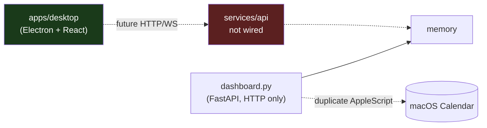
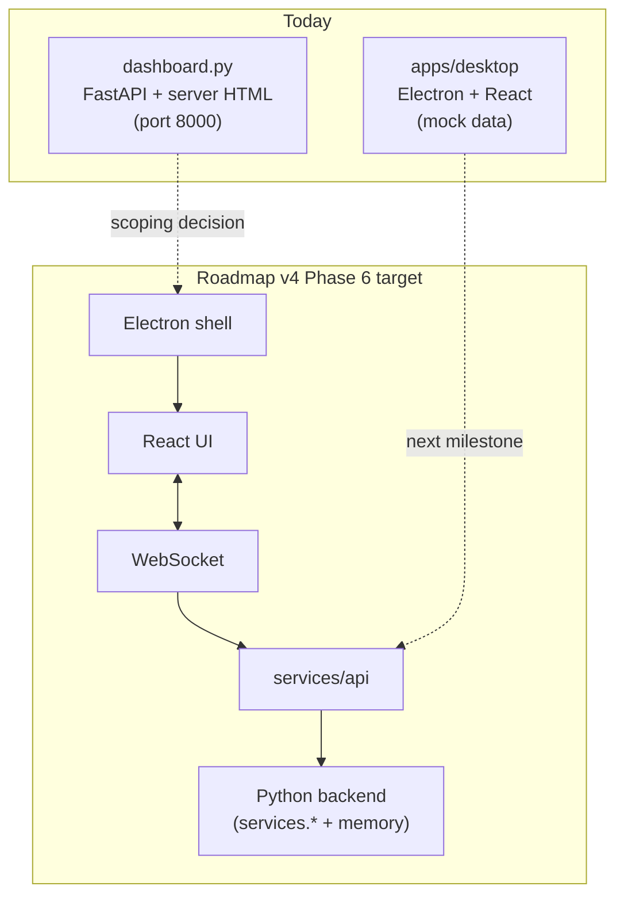

# Phase 6 — Desktop

> Deliverables per roadmap: Electron, React, WebSocket, Live dashboard, Memory search, Voice UI.
> Verification: the desktop application becomes the primary interface.

**Status: Scaffold in progress — Electron/React shell exists; API/WebSocket/voice UI not started**

**Gate:** Blocked behind Phases 1–5 per roadmap ordering for full deliverables; desktop shell milestone (vite-plugin-electron) complete.

---

## 1. What changed

An Electron + React scaffold now lives at `apps/desktop/`:

- **Electron 43** main/preload (`electron/main.ts`, `electron/preload.ts`)
- **React 19** renderer with React Router, Zustand, Tailwind, shadcn/ui
- **Unified dev workflow** via Vite 8 + `vite-plugin-electron@^1.1.0` (`npm run dev`)
- **Mock data only** — no `services/api` integration yet
- **No WebSocket, voice UI, or live backend data**

`dashboard.py` (738 lines, FastAPI + server-rendered HTML) still provides overlapping dashboard value but is a separate, non-conforming artifact. The scoping decision in the original report still applies before full Phase 6 delivery.

## 2. Folder structure

```
apps/desktop/
├── electron/          # main.ts, preload.ts
├── src/               # React screens, components, mocks
├── dist/              # built renderer (production)
├── dist-electron/     # built main.js + preload.mjs
├── vite.config.ts     # vite-plugin-electron/simple
└── README.md          # development workflow
```

`dashboard.py` remains at the repo root as a separate FastAPI dashboard.

## 3. Files added (desktop scaffold)

| Path | Note |
|------|------|
| `apps/desktop/` | Electron + React shell; mock data; vite-plugin-electron workflow |
| `apps/desktop/README.md` | Dev/build/start documentation |

## 4. Files modified

None in backend services. Desktop is a leaf consumer (future: `services/api` over network only).

## 5. Public APIs

- **Desktop preload:** `window.desktopWindow.{minimize,maximize,close}` → IPC to main process
- **Backend:** not connected. `dashboard.py` still exposes HTTP routes separately; no WebSocket endpoint exists yet

## 6. Dependency graph



## 7. Remaining work

- Wire desktop to `services/api` (HTTP + WebSocket)
- Replace mock data with live backend responses
- Voice UI overlay and live transcript
- Memory search UI backed by API
- Scoping decision: relationship between `dashboard.py` and Electron desktop

## 8. Known issues

- `dashboard.py` duplicates calendar-fetch logic from `nova.py` rather than sharing it
- Desktop uses mock data only; no backend integration
- `dashboard.py` is entirely untested

## 9. Architecture diagram



## 10. Current completion percentage

**~15%** against the literal Roadmap v4 Phase 6 spec: Electron/React shell and dev tooling exist; WebSocket, live data, memory search UI, and voice UI do not. The FastAPI dashboard still covers part of the *intent* but not the Electron deliverables.
